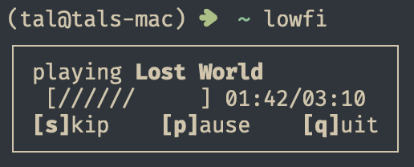

# lowfi

lowfi is a tiny rust app that serves a single purpose: play lofi.
It'll do this as simply as it can: no albums, no ads, just lofi.



## Disclaimer

**All** of the audio files played in lowfi are from [Lofi Girl's](https://lofigirl.com/) website,
under their [licensing guidelines](https://form.lofigirl.com/CommercialLicense).

If god forbid you're planning to use this in a commercial setting, please
follow their rules.

## Why?

I really hate modern music platforms, and I wanted a small, "suckless"
app that would just play random lofi without video.

It was also designed to be fairly resilient to inconsistent networks,
and as such it buffers 5 whole songs at a time instead of parts of the same song.

Although, lowfi is yet to be properly tested in difficult conditions,
so don't rely on it too much until I do that. See [Scraping](#scraping) if
you're interested in downloading the tracks. Beware, there's a lot of them.

## Installing

> [!NOTE]
>
> If you're interested in maintaining a package for `lowfi`
> on package managers such as homebrew and the like, open an issue.

### Dependencies

You'll need Rust 1.74.0+.

On MacOS & Windows, no extra dependencies are needed.

On Linux, you'll also need openssl & alsa, as well as their headers.

- `alsa-lib` on Arch, `libasound2-dev` on Ubuntu.
- `openssl` on Arch, `libssl-dev` on Ubuntu.

Make sure to also install `pulseaudio-alsa` if you're using PulseAudio.

### Cargo

The recommended installation method is to use cargo:

```sh
cargo install lowfi

# If you want MPRIS support.
cargo install lowfi --features mpris
```

and making sure `$HOME/.cargo/bin` is added to `$PATH`.

### Release Binaries

If you're struggling or unwilling to use cargo, you can just download
precompiled binaries from the [latest release](https://github.com/talwat/lowfi/releases/latest).

### AUR

```sh
yay -S lowfi
```

### openSUSE

```sh
zypper install lowfi
```

### Debian

> [!NOTE]
> This uses an unofficial Debian repository maintained by [Dario Griffo](https://github.com/dariogriffo).

```sh
curl -sS https://debian.griffo.io/3B9335DF576D3D58059C6AA50B56A1A69762E9FF.asc | gpg --dearmor --yes -o /etc/apt/trusted.gpg.d/debian.griffo.io.gpg
echo "deb https://debian.griffo.io//apt $(lsb_release -sc 2>/dev/null) main" | sudo tee /etc/apt/sources.list.d/debian.griffo.io.list
sudo apt install -y lowfi
```

### Fedora (COPR)

> [!NOTE]
> This uses an unofficial COPR repository by [FurqanHun](https://github.com/FurqanHun).

```sh
sudo dnf copr enable furqanhun/lowfi
sudo dnf install lowfi
```

### Manual

This is good for debugging, especially in issues.

```sh
git clone https://github.com/talwat/lowfi
cd lowfi

# If you want an actual binary
cargo build --release --all-features
./target/release/lowfi

# If you just want to test
cargo run --all-features
```

## Usage

`lowfi`

Yeah, that's it.

### Controls

| Key                | Function        |
| ------------------ | --------------- |
| `s`, `n`, `l`      | Skip Song       |
| `p`, Space         | Play/Pause      |
| `+`, `=`, `k`, `↑` | Volume Up 10%   |
| `→`                | Volume Up 1%    |
| `-`, `_`, `j`, `↓` | Volume Down 10% |
| `←`                | Volume Down 1%  |
| `q`, CTRL+C        | Quit            |

> [!NOTE]
> Besides its regular controls, lowfi offers compatibility with Media Keys
> and [MPRIS](https://wiki.archlinux.org/title/MPRIS) (with tools like `playerctl`)
>
> MPRIS is currently optional feature in cargo (enabled with `--features mpris`)
> due to it being only for Linux, as well as the fact that the main point of
> lowfi is it's unique & minimal interface.

### Extra Flags

If you have something you'd like to tweak about lowfi, you use additional flags which
slightly tweak the UI or behaviour of the menu. The flags can be viewed with `lowfi help`.

| Flag                               | Function                                       |
| ---------------------------------- | ---------------------------------------------- |
| `-a`, `--alternate`                | Use an alternate terminal screen               |
| `-m`, `--minimalist`               | Hide the bottom control bar                    |
| `-b`, `--borderless`               | Exclude borders in UI                          |
| `-p`, `--paused`                   | Start lowfi paused                             |
| `-d`, `--debug`                    | Include ALSA & other logs                      |
| `-w`, `--width <WIDTH>`            | Width of the player, from 0 to 32 [default: 3] |
| `-t`, `--track-list <TRACK_LIST>`  | Use a [custom track list](#custom-track-lists) |
| `-s`, `--buffer-size <BUFFER_SIZE` | Internal song buffer size [default: 5]         |

### Scraping

lowfi also has a `scrape` command which is usually not relevant, but
if you're trying to download some files from Lofi Girls' website,
it can be useful.

An example of scrape is as follows,

`lowfi scrape --extension zip --include-full`

where more information can be found by running `lowfi help scrape`.

### Custom Track Lists

> [!WARNING]
>
> Custom track lists are going to be pretty particular.
> This is because I still want to keep `lowfi` as simple as possible,
> so custom lists will be very similar to how the built in list functions.
>
> This also means that there will be no added flexibility to these lists,
> so you'll have to work that out on your own.

lowfi also supports custom track lists, although the default one from Lofi Girl
is embedded into the binary.

To use a custom list, use the `--tracks` flag. This can either be a path to some file,
or it could also be the name of a file (without the `.txt` extension) in the data
directory, so on Linux it's `~/.local/share/lowfi`.

For example, `lowfi --tracks minipop` would load `~/.local/share/lowfi/minipop.txt`.
Whereas if you did `lowfi --tracks ~/Music/minipop.txt` it would load from that
specified directory.

#### The Format

In lists, the first line should be the base URL, followed by the rest of the tracks.
This is also known as the "header", because it comes first.

Each track will be first appended to the base URL, and then the result use to download
the track. All tracks must be in the MP3 format, as lowfi doesn't support any others currently.

Additionally, lowfi _won't_ put a `/` between the base & track for added flexibility,
so for most cases you should have a trailing `/` in your base url.
The exception to this is if the track name begins with something like `https://`,
where in that case the base will not be prepended to it.

For example, in this list:

```txt
https://lofigirl.com/wp-content/uploads/
2023/06/Foudroie-Finding-The-Edge-V2.mp3
2023/04/2-In-Front-Of-Me.mp3
https://file-examples.com/storage/fea570b16e6703ef79e65b4/2017/11/file_example_MP3_5MG.mp3
```

lowfi would download these three URLs:

- `https://lofigirl.com/wp-content/uploads/2023/06/Foudroie-Finding-The-Edge-V2.mp3`
- `https://file-examples.com/storage/fea570b16e6703ef79e65b4/2017/11/file_example_MP3_5MG.mp3`
- `https://lofigirl.com/wp-content/uploads/2023/04/2-In-Front-Of-Me.mp3`

Additionally, you may also specify a custom display name for the track which is indicated by a `!`.
For example, if you had an entry like this:

```txt
2023/04/2-In-Front-Of-Me.mp3!custom name
```

Then lowfi would download from the first section, and display the second as the track name.

Further examples can be found in the [data](https://github.com/talwat/lowfi/tree/main/data) folder.
